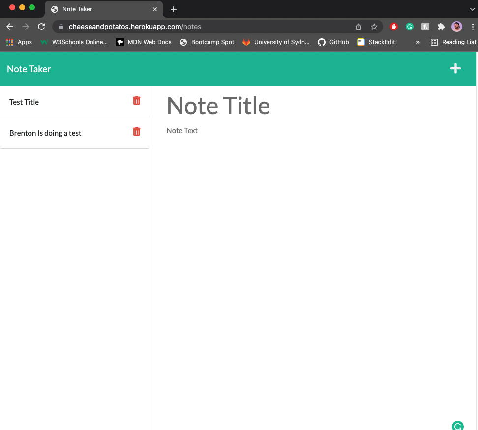
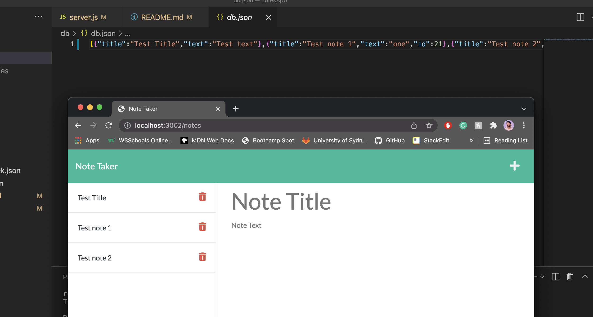

# 11 Express.js: Note Taker

## Description
<hl>
A simple note taking application that allows you create, store and display notes in a clean simple HTML layout.

<br>
<br>

## Deployed applications are viewable below:

heroku @ https://cheeseandpotatos.herokuapp.com/

github @ https://github.com/Brento20/notesApp

<br>
<br>

## Check List:
|Description | Status |
|--|--|
| Page Loads on Heroku (lets start with some low expectations) | Done |
| Uses Express.js | Done|
|back end must store notes that have a unique id in a JSON file|Done|
| Can navigate between index.html and notes.html |Done|
| Can enter and store a note |Done|
| Bonus - Can delete notes |Future update|

<br>
<br>

## Installation Tips

```
This application uses node.js, express.js. Please ensure these are installed prior to running the application.

Run the application in terminal using "npm start"
```


## Acceptance Criteria

```
GIVEN a note-taking application
WHEN I open the Note Taker
THEN I am presented with a landing page with a link to a notes page
WHEN I click on the link to the notes page
THEN I am presented with a page with existing notes listed in the left-hand column, plus empty fields to enter a new note title and the note’s text in the right-hand column
WHEN I enter a new note title and the note’s text
THEN a Save icon appears in the navigation at the top of the page
WHEN I click on the Save icon
THEN the new note I have entered is saved and appears in the left-hand column with the other existing notes
WHEN I click on an existing note in the list in the left-hand column
THEN that note appears in the right-hand column
WHEN I click on the Write icon in the navigation at the top of the page
THEN I am presented with empty fields to enter a new note title and the note’s text in the right-hand column
```


## Mock-Up/Screen Shots

The following images show the web application's appearance and functionality:


Web application deployed on Heroku.


Unique ID's and data stored in array in db.json, example demonstrated on local server.


